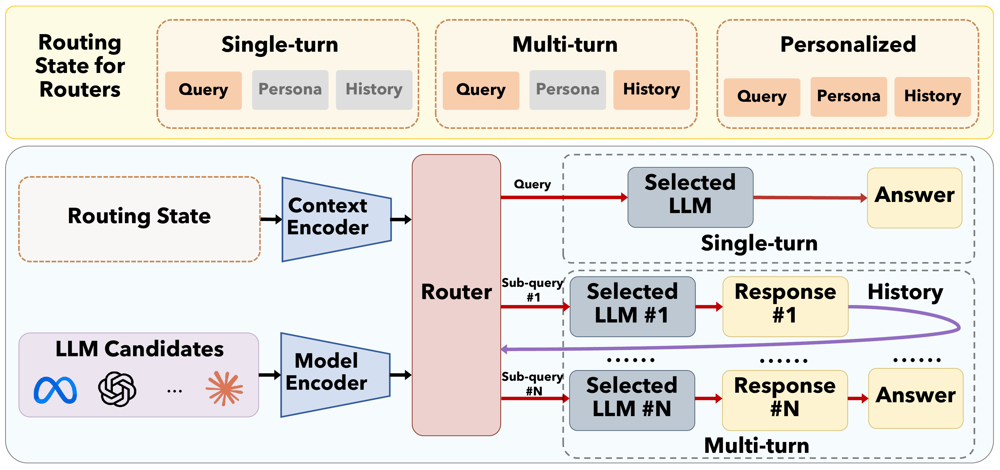
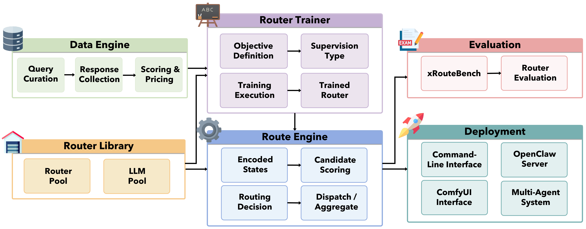
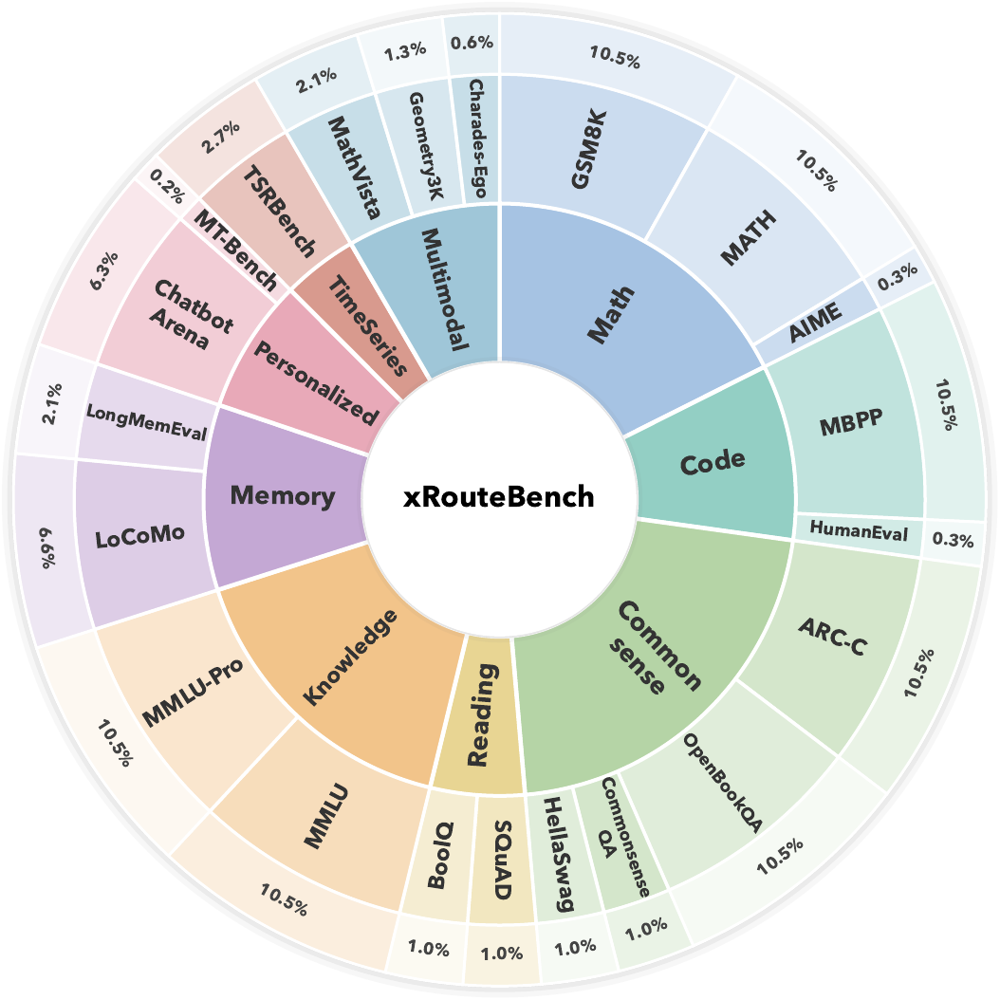
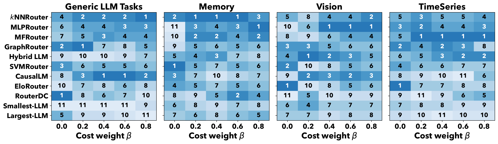
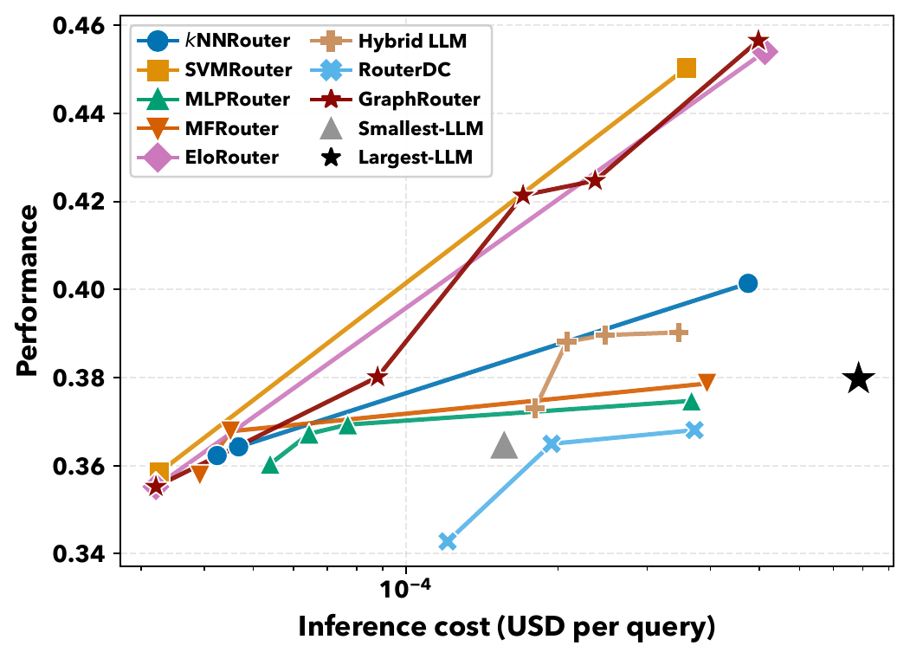
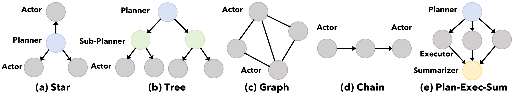

# LLMRouter: a common foundation for choosing the right LLM

Modern LLM applications rarely need a single model. They need a way to decide which model should handle each request.

## Why LLM Routing Matters

The LLM ecosystem is now a collection of models with very different strengths. Some models are powerful but expensive. Some are much cheaper but solve a narrower set of requests well. Some handle long context, images, video, or structured reasoning better than others. And for applications with recurring users, the best answer may depend on the person asking the question.

This changes a familiar deployment decision. Instead of selecting one default model for an entire product, a system can make a model choice for every request.

That is LLM routing: given a request and a pool of candidate models, decide which model should answer it. The decision is not only about response quality. It is also about the cost of obtaining that response.

The intuition is straightforward. Always sending every request to the largest available model is often expensive, and it is not always the most effective choice. A smaller model can solve many requests well. A specialized model can be a better fit for another request. A user-aware policy may choose differently for the same query when different preferences or histories are involved.

> **Key insight**
>
> Routing is not a small optimization on top of an LLM application. It is a systems decision that determines how quality, cost, context, and model capability meet on every request.

There is already a large and diverse body of routing work: binary routers that choose between a weak and strong model, cost-aware cascades, graph-based methods, multi-turn and agentic policies, and personalized routers. The challenge is that these methods are often developed in separate codebases, with different interfaces, supervision data, candidate pools, and evaluation protocols.

As a result, it is difficult to tell what is actually being compared. Is one router better because of its policy, its training data, its model pool, or its evaluation setup? And because evaluating a router requires knowing how every candidate model performs on every query, simply building a fair benchmark is expensive.

LLMRouter brings these pieces together: a common formulation for routing, a reusable library, an automated evaluation pipeline, and a multi-scenario benchmark called xRouteBench.

## A Unified View of LLM Routing

Many routers look different on the surface. A simple nearest-neighbor router, a cost-aware cascade, a graph-based router, and a multi-turn agentic policy may use different inputs and make different kinds of decisions. Underneath, they can all be described as a sequence of choices: inspect the current state, select a model or stop, observe the result, and decide what to do next.

The routing state can include the input query, optional user context, and the interaction history accumulated so far. A router can dispatch the request to one candidate model, or it can terminate and aggregate responses it has already collected. Single-turn routing is the special case where the system dispatches once and then stops.



*Figure 1. Unified formulation of LLM routing. Single-turn, multi-turn, and personalized routers differ primarily in which parts of the routing state they observe and how they make the next decision.*

The formulation makes five building blocks explicit.

- **Context encoder.** This represents what the router knows about the current decision: the query, previous responses, interaction history, and possibly user information. It can be an embedding, a learned representation, or text passed directly to a language model.
- **Model encoder.** This represents each candidate model. A model may be described by its price and metadata, its historical behavior on prior queries, a learned embedding, or a natural-language description.
- **Scoring function.** This estimates how suitable a candidate is for the current state.
- **Decision rule.** This turns scores into an action. The router may select one model, route again after observing a response, or terminate and aggregate collected responses.
- **Learning signal.** This defines what the router should optimize. It can be a pointwise or pairwise training loss, or a trajectory-level reward that balances response quality and inference cost.

The point of this decomposition is not to make every router identical. It is to make the choices inside each router visible.

A single-turn router can focus only on the query. A multi-turn router can include the responses it has gathered so far. A personalized router can add a user representation or history. The same vocabulary makes these approaches easier to compare, extend, and combine.

> **Key insight**
>
> Existing routing methods look different because they make different choices about state, candidate representation, scoring, decision, and learning—not because they require entirely different systems.

This view also makes the quality–cost trade-off explicit. The routing policy should seek high-quality answers while controlling the cost of all model calls along its path. A deployment can therefore decide how much it values quality relative to cost instead of treating one fixed operating point as universally correct.

## From Research Papers to One Library

Once routers share a common formulation, they can share the infrastructure around them. LLMRouter turns that idea into a library organized around a common query–model matrix: a record of how candidate models respond to benchmark queries, how those responses are scored, and what they cost.



*Figure 3. LLMRouter architecture. The data engine, router trainer, route engine, evaluation module, and deployment layer are reusable across router families.*

The **data engine** curates queries, collects responses from the candidate pool, and records task scores and pricing. This creates the supervision required by learned routers.

The **router library** contains reusable implementations of more than 16 routers across three families: single-turn, multi-turn, and personalized routing. Methods can share the same data and runtime even when they use different state representations or training objectives.

The **router trainer** is responsible for fitting a router. It separates the learning signal from the router itself, so the same scoring mechanism can be trained with different forms of supervision when appropriate. Non-parametric routers can simply skip this stage.

The **route engine** performs the runtime work: encode the state, score candidate models, make a routing decision, dispatch the request, and—when a policy is multi-turn—repeat until it terminates and aggregates the trajectory.

The **evaluation module** runs routers on the same queries, candidate pool, metrics, and quality–cost settings. This is what makes a reported difference about the router rather than a hidden difference in experimental conditions.

Finally, the **deployment layer** exposes the same router outside an offline experiment. A router evaluated in the benchmark can be served through a command-line interface, an OpenAI-compatible server, or a visual ComfyUI workflow without rewriting its core logic.

> **Why this matters**
>
> A new router should be a new routing policy, not a new data pipeline, training stack, evaluator, and deployment system.

## xRouteBench

Routing evaluation is harder than evaluating one model. To train or test a router fairly, the system needs to know how every candidate model performs on each query. It must also know what each candidate costs.

That requirement becomes especially important outside short, text-only requests. Long-context tasks can be dominated by input-token cost. Image and video requests may only be supported by part of the model pool. Time-series tasks can admit multiple representations. Personalized settings need context about users, not only population-level preference data.

xRouteBench is designed around these differences. It uses an automated pipeline to construct routing supervision by running a candidate pool over benchmark queries, scoring each response with the appropriate task metric, and recording token-level inference cost. Every router is then evaluated under the same protocol.



*Figure 2. xRouteBench task statistics. The benchmark covers five routing tracks and eight test sets under one quality–cost evaluation protocol.*

The benchmark spans five settings:

- **Generic LLM tasks**, including diverse natural-language problems.
- **Memory**, where the router receives long-context conversational information and responses are scored with token-level F1.
- **Vision**, covering image reasoning and multi-view video recognition through self-contained textual queries with optional references to the original assets.
- **Time-series**, where routing must account for different encodings of pattern-reasoning inputs.
- **Personalization**, where answer quality is judged relative to a user persona or preference signal.

Across these settings, xRouteBench contains eight test sets and 4,767 instances. The evaluation uses 18 open-weight candidate models served through two providers, ranging from 7B to 671B parameters.

--8<-- "docs/blog/experiment-tables.md:1:18"

The key design choice is that quality and cost are evaluated together. Routers are scored with a weighted objective that trades off task performance against inference cost. The benchmark sweeps five settings, from a quality-only operating point to one that heavily emphasizes cost.

> **Key insight**
>
> A routing result is incomplete without its operating point. The best quality-first router may be a poor choice when the deployment budget becomes tight.

Because xRouteBench uses one query schema, supervision format, and evaluation protocol across all tracks, adding a new application becomes a focused task: register a transformation for the input and a metric for the output. The surrounding routing pipeline remains the same.

## Build Your Own Router

The library is designed so that extending it does not require forking the system. A new router implements routing logic, and a trainer supplies the learning signal when training is needed. The rest of the workflow—data construction, training execution, route dispatch, evaluation, and deployment—stays shared.

```python
from llmrouter.models.meta_router import MetaRouter


class MyRouter(MetaRouter):
    def route_single(self, query):
        # Context encoder: represent the request state.
        state = self.encode_state(query)

        # Model encoder + scoring function: score candidates.
        scores = self.score(state, self.models)

        # Decision rule: choose the next model.
        query["model_name"] = self.decide(scores)
        return query


class MyRouterTrainer(BaseTrainer):
    def loss_func(self, outputs, batch):
        # Learning signal: pointwise, pairwise, or trajectory-level.
        return my_objective(outputs, batch)


router = MyRouter(yaml_path="my_router.yaml")
trainer = MyRouterTrainer(router)
trainer.train()
answer = router.route_single({"query": "..."})
```

The router class contains the context encoder, model encoder, scoring function, and decision rule. The trainer class owns the learning signal. A router can implement `route_single` or its batched counterpart, `route_batch`.

This separation is practical. A researcher can change the router policy without rebuilding the evaluator. An engineer can swap the candidate pool or the quality–cost objective through configuration. A non-parametric baseline can use the route engine without requiring a trainer at all.

The interface also supports personalization and component ablations. Changing the information available to the context encoder can turn a user-agnostic router into a user-conditioned one without replacing the surrounding system.

## What We Learned

The study evaluates more than 16 router implementations across the xRouteBench tracks. The goal is not to name one universal winner. It is to understand what changes when the task, budget, interaction structure, and user context change.

--8<-- "docs/blog/experiment-tables.md:19:44"

### Learned routers create headroom over a fixed model

Learned routing improves by **14.6% relative** over the strongest fixed-model baseline in the study.

This result is important because always selecting the largest model is both the most expensive option and not consistently the strongest one. Learned routers can send many requests to smaller, cheaper models while reserving more capable candidates for requests where they are useful. They can also recover queries that the largest fixed model happens to answer incorrectly.

The benefit is not simply “use a cheaper model more often.” It comes from recognizing that model capability is uneven across requests.

### No router wins everywhere

Router rankings change across tasks. RouterDC leads the generic LLM task track in the performance-first setting, while SVMRouter leads on LoCoMo. GraphRouter has the strongest average across xRouteBench, yet it does not win every task.

The rankings also change as the cost weight increases.



*Figure 5. Router ranking across quality–cost settings. Increasing the cost weight can reverse the ordering of routers within the same task category.*

For example, RouterDC leads generic LLM tasks when only quality matters but falls to ninth of ten under the most cost-sensitive setting. In vision, MLPRouter is near the bottom under a quality-first objective but becomes the best choice for every setting with a cost weight of at least 0.4.

> **Key insight**
>
> “Best router” is not a global label. It is a decision that depends on the deployment task and the quality–cost trade-off the deployment actually needs.

### Multi-turn routing is not automatically better

Multiple rounds of routing and aggregation do not consistently improve over a single routing decision in these experiments.

For many requests, one well-chosen route is enough. Additional rounds can add redundant information and computational overhead. Multi-turn routers also rely on a base model to decompose the request and aggregate responses; their behavior is therefore sensitive to the capability of that base model.

This does not mean multi-turn routing is unhelpful. It means that extra steps should earn their cost. Better sufficiency estimation, early stopping, and more effective decomposition and aggregation remain important directions for multi-turn routing systems.

### Personalization consistently helps

Routers built for personalization perform best on the human-preference-oriented setting. They condition decisions on user-specific signals instead of optimizing one average policy for everyone.

On the persona-conditioned personalized track, GMTRouter reaches 68.78, ahead of the best user-agnostic router, EloRouter, at 66.40. The result illustrates a broader point: user context changes what counts as a good answer, so it can also change which model is the right choice.

--8<-- "docs/blog/experiment-tables.md:45:60"

### Quality and cost form a frontier



*Figure 6. Performance versus per-query cost, averaged across xRouteBench tasks. Higher cost often improves performance, but the largest fixed model is not a universally efficient choice.*

For most routers, higher inference cost is associated with better performance because a larger budget unlocks more capable and expensive candidates. But the largest fixed model is dominated by learned routes in the study: it incurs the highest cost while delivering only mediocre performance relative to the routing frontier.

The practical lesson is not to eliminate cost. It is to spend it where it changes the answer.

## From Benchmarks to Real Systems

Offline evaluation is necessary, but routing systems eventually make decisions for people and applications. LLMRouter includes a deployment layer that exposes a trained router as an OpenAI-compatible server and integrates with OpenClaw for messaging platforms such as Slack and Discord. A routing memory preserves interaction history across turns, while a ComfyUI canvas supports code-free prototyping.

The deployment experiments cover both real-user routing and multi-agent systems.

In the Slack setting, 15 users contributed 40 sessions with one to twelve turns, producing 234 pairwise preference records. For each query, answers from two sampled models were presented in randomized order, and users selected a preferred answer or declared a tie. On held-out sessions, PersonalizedRouter reached 83.05. The result also shows why real feedback matters: the ranking under simulated persona evaluation did not fully transfer to live users.

--8<-- "docs/blog/experiment-tables.md:61:76"

Multi-agent systems provide another setting where routing is naturally granular. Rather than assigning one base model to every agent, LLMRouter treats model choice as a per-agent decision. Planning, execution, verification, and summarization prompts can have very different requirements, even inside the same workflow.



*Figure 7. Multi-agent coordination topologies used to evaluate per-agent routing: Star, Tree, Graph, Chain, and Plan-Exec-Sum.*

Across five coordination topologies, the best router, MFRouter, achieved an average score of 76.48 compared with 71.48 for always selecting the largest model. Routing every node therefore improved over the largest-model baseline across all five topologies in the experiment.

--8<-- "docs/blog/experiment-tables.md:77:"

> **Key insight**
>
> A multi-agent system does not need one model identity. It can make a model decision at every functional node.

## Open Source

LLMRouter is released as an open-source foundation for developing, evaluating, and deploying LLM routers. The library, xRouteBench benchmark, and evaluation artifacts are intended to make routing research easier to reproduce and easier to move into real systems.

- **GitHub:** [LLMRouter](https://github.com/ulab-uiuc/LLMRouter)
- **Paper:** [LLMRouter: A Unified Library, Evaluation, and Analysis for LLM Routing](#)

If you use LLMRouter, please cite:

```bibtex
@misc{feng2026llmrouter,
  title  = {LLMRouter: A Unified Library, Evaluation, and Analysis for LLM Routing},
  author = {Tao Feng},
  year   = {2026}
}
```
